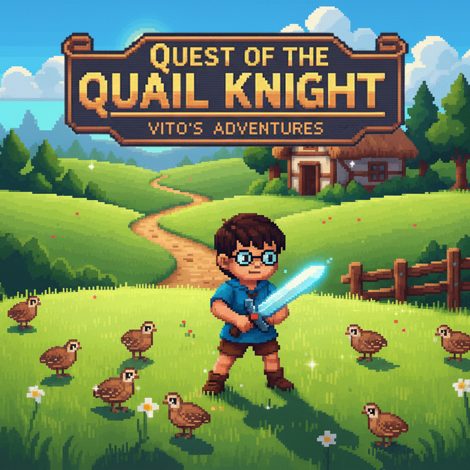

# Quest of Quail Knight
> Make Phaser 3 games with modern frontend tooling.




## About the Game

**Quest of Quail Knight** is a small **pixel art** game made purely for fun. It tells the adventures of **Vito**, a somewhat clumsy but determined knight, on his quest to **hunt quails**. The project began as a personal experiment to explore **Phaser 3** and modern front-end development techniques applied to game development. Simple, ironic, and deliberately retro, *Quest of Quail Knight* is a tribute to old arcade games—with a touch of humor and a lot of passion for pixel art.

<details>
<summary>🇮🇹 Leggi in Italiano</summary>

**Quest of Quail Knight** è un piccolo gioco in **pixel art** realizzato per puro divertimento. Racconta le avventure di **Vito**, un cavaliere un po' goffo ma determinato, impegnato nella sua missione di **caccia alle quaglie**. Il progetto nasce come esperimento personale per esplorare **Phaser 3** e le moderne tecniche di sviluppo frontend applicate al game development. Semplice, ironico e volutamente rétro, *Quest of Quail Knight* è un tributo ai vecchi giochi arcade — con un tocco di umorismo e tanta passione per la pixel art.
</details>

---

## Credits

- **Development & Design:** VinZo  
- **Website:** [vincenzociaccia.it](https://vincenzociaccia.it)

---

## Prerequisites

You'll need [Node.js](https://nodejs.org/en/) and [npm](https://www.npmjs.com/) installed.

It is highly recommended to use [Node Version Manager](https://github.com/nvm-sh/nvm) (nvm) to install Node.js and npm.

For Windows users there is [Node Version Manager for Windows](https://github.com/coreybutler/nvm-windows).

Install Node.js and `npm` with `nvm`:

```bash
nvm install node

nvm use node
```

Replace 'node' with 'latest' for `nvm-windows`.

## Getting Started

You can clone this repository or use [degit](https://github.com/Rich-Harris/degit) to scaffold the project like this:

```bash
npx degit https://github.com/ourcade/phaser3-vite-template my-folder-name
cd my-folder-name

npm install
```

Start development server:

```
npm run start
```

To create a production build:

```
npm run build
```

Production files will be placed in the `dist` folder. Then upload those files to a web server. 🎉

## Project Structure

```
    .
    ├── dist
    ├── node_modules
    ├── public
    ├── src
    │   ├── HelloWorldScene.js
    │   ├── main.js
	├── index.html
    ├── package.json
```

JavaScript files are intended for the `src` folder. `main.js` is the entry point referenced by `index.html`.

Other than that there is no opinion on how you should structure your project.

There is an example `HelloWorldScene.js` file that can be placed inside a `scenes` folder to organize by type or elsewhere to organize by function. For example, you can keep all files specific to the HelloWorld scene in a `hello-world` folder.

It is all up to you!

## Static Assets

Any static assets like images or audio files should be placed in the `public` folder. It'll then be served from the root. For example: http://localhost:8000/images/my-image.png

Example `public` structure:

```
    public
    ├── images
    │   ├── my-image.png
    ├── music
    │   ├── ...
    ├── sfx
    │   ├── ...
```

They can then be loaded by Phaser with `this.image.load('my-image', 'images/my-image.png')`.

# ESLint

This template uses a basic `eslint` set up for code linting to help you find and fix common problems in your JavaScript code.

It does not aim to be opinionated.

[See here for rules to turn on or off](https://eslint.org/docs/rules/).

## Dev Server Port

You can change the dev server's port number by modifying the `vite.config.js` file. Look for the `server` section:

```js
{
	// ...
	server: { host: '0.0.0.0', port: 8000 },
}
```

Change 8000 to whatever you want.

## License

[MIT License](https://github.com/ourcade/phaser3-vite-template/blob/master/LICENSE)
